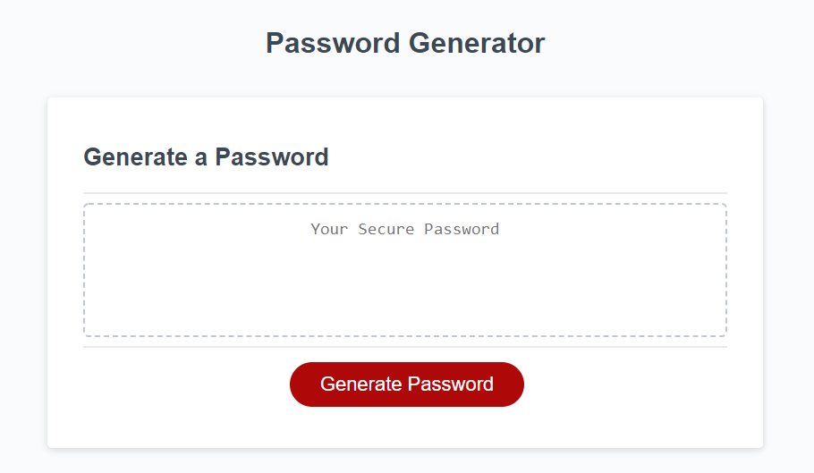
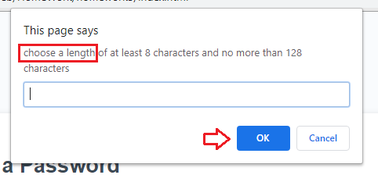
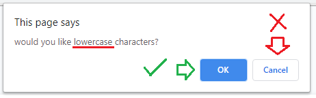
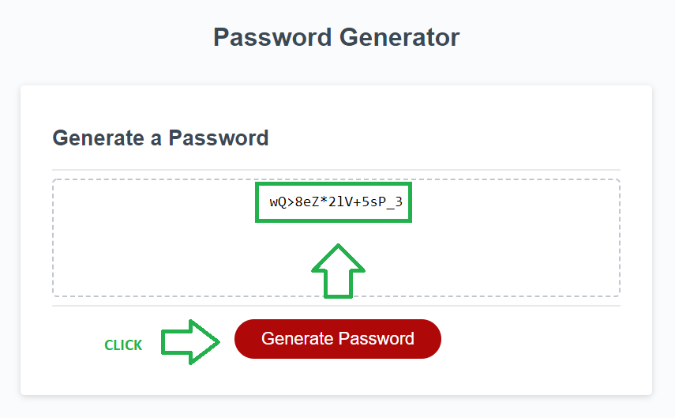
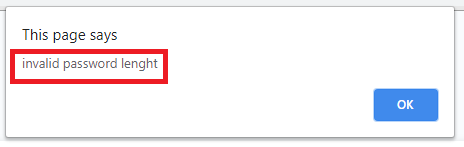
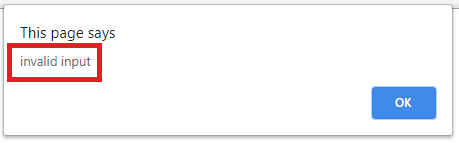

# homework3
Name

"Password Generator".

instruction 
(Hold "Ctrl" key while you click on image "sample.png" to visualize)

  step 1

  

  -Open URL at the end of this ReadMe file, (recomended Browser: Google Chrome).

  step 2

  

  -An alert will pop up and it will ask you to choose the lenght of your password.

  step 3

  

  -Follow by 4 question (what type of characters would you like to include? you can pick more than one: lower case, upper case, symbols and numeric) which will be the criteria to build your password.

  step 4

  

  -Click on Generate button and the new password will print inside the box.

  step 5

   invalid lenght

   

   -Make sure your password lenght is between 8 and 128 charaters long, or you will receive an "invalid lenght" alert message.

   invalid criteria

   

   -Choose at least one of the four password criteria, or you will receive an "invalid input" alert message.

Description

This is a password generator builded with javascript, which can support the layout of: CellPhones "640px", Tablets "768px", and Laptops "980px"

Details

This repository content the html files: index "main page", the CSS styles "style.css" and the JavaScript "script.js".

URL 

The URL to open the page on your Browser is " https://diegolehyt.github.io/homework3/"